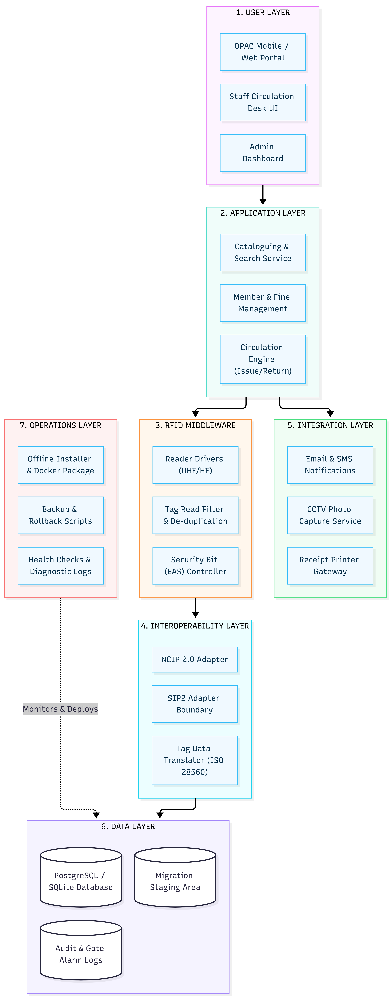

# AISYS RFID-Enabled Library Management System

An enterprise-grade, RFID-integrated Library Management System built with Python and FastAPI. The system features a 7-layer architecture, real-time security gate middleware, protocol interoperability (NCIP 2.0 / SIP2), automated inventory auditing, and data migration utilities.

---

## 📑 System Architecture

The project follows a **Modular 7-Layer Architecture**:



1. **Presentation / API Layer (`FastAPI`):** RESTful endpoints with Role-Based Access Control (RBAC) via `X-Role` headers.
2. **Protocol Interoperability Layer:** Mock adapters for **NCIP 2.0** and **SIP2** protocols.
3. **Circulation Logic Layer:** Rules engine enforcing loan caps (max 5 items), fine thresholds (₹500 limit), member blocking, and reference item restrictions.
4. **RFID Middleware & Gate Security:** Physical exit gate monitoring, alarm logging, and mock CCTV snapshot generation upon unauthorized item removal.
5. **Inventory Audit Layer:** Batch reconciliation of handheld RFID shelf scans (identifying missing, misplaced, or unissued items).
6. **Notification Services:** Asynchronous background email dispatching for security breach alerts.
7. **Persistence Repository:** In-memory transactional data store with SQLite backup and relational database compatibility.

---

## 📦 Deliverables & Documentation Index (SOP D1–D9)

| Deliverable | Package / File | Description |
| :--- | :--- | :--- |
| **D1** | `REQUIREMENTS_TRACEABILITY_MATRIX.md` | Requirements Traceability Matrix mapping FR 01–12, NFR 01–09, and AC 01–10 to implementation code and test cases. |
| **D2 / D3** | `ARCHITECTURE.md` | Comprehensive architectural specification and 7-layer design documentation. |
| **D4** | `LICENSE_INVENTORY.md` | Software Bill of Materials (SBOM) detailing pinned dependencies and open-source license compliance. |
| **D5** | `migrate.py` | Production Excel/CSV spreadsheet data migration and reconciliation tool with transaction rollback support. |
| **D6** | `test_acceptance.py` | Automated Pytest acceptance test suite with 49 passing tests (100% pass rate). |
| **D7 / D8** | `OPERATIONS_AND_RUNBOOK.md` | Administrator Guide, User Guide, Air-Gapped/Offline Installation Guide, and Incident Troubleshooting Runbook. |
| **D9** | `PRESENTATION.md` | 12-slide technical deck formatted for Gamma import and PDF export summarizing design, compliance, and backlog. |

---

## 🚀 Getting Started

### Prerequisites
* Python 3.11+ (Compatible with Python 3.12 / 3.14)
* `pip` package manager

### 1. Installation
Clone the repository and install required dependencies:
```bash
git clone https://github.com/MouliPalluru/aisys_rfid_library.git
cd aisys_rfid_library
pip install -r requirements.txt
